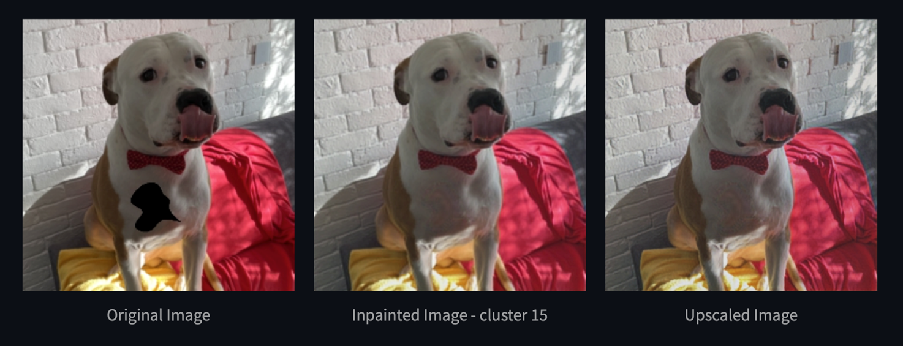

# Reconstruction and Quality Enhancement of Images Using Autoencoders

The project focuses on utilizing autoencoders for reconstructing damaged images, increasing their resolution, and clustering them based on visual similarity. An unsupervised learning approach was applied, enabling automatic image grouping and efficient reconstruction.

The primary application of this project is the restoration of damaged artworks and the enhancement of their quality using advanced artificial intelligence models. The implementation is based on the **PyTorch** library, and experiments were conducted using the **WikiArt** dataset, available on the HuggingFace platform, which includes **81,444 images** from **27 different artistic styles**:

- **Dataset of images with a resolution of 256×256**: *WikiArt_Full*
- **Dataset of higher-resolution images**: *Huggan WikiArt*

## Models and Architecture

The project is based on **VGG16** and **U-Net** architectures, which were adapted for image reconstruction tasks. The autoencoders were trained using **Perceptual Loss** and **MSE (Mean Squared Error) loss functions**, allowing for high-quality reconstruction and improved model effectiveness in resolution enhancement tasks.

## Image Clustering

To group images based on their visual similarity, an **autoencoder** was designed to map the features of the input image. After training, the **encoder layer** was used for feature extraction, which was then analyzed using clustering techniques. This approach resulted in 20 distinct image classes, each representing different artistic styles and visual characteristics, as demonstrated in the `cluster_dataset.ipynb` notebook.

## Inpainting – Reconstruction of Damaged Images

For reconstructing missing parts of images, a **generator of synthetic "spots"** was developed to simulate irregularly shaped damages, with a maximum size of **1/16 of the image**. To enhance the model’s effectiveness in reconstructing missing elements, the loss function was modified by assigning a **10-times higher weight** to pixels within the damaged regions.

The model was initially trained on the full dataset and then fine-tuned for individual image clusters, allowing for more precise reconstruction specific to each artistic style.

    
    

    
    

## Super-Resolution

As part of the project, a model was developed to increase image resolution from **256×256 to 512×512**. The model was trained on lower-resolution images with the task of generating higher-quality details while preserving stylistic elements.

    
    

    
    

Thanks to the applied techniques and algorithms, the project enables effective **image quality enhancement, reconstruction of damaged artworks, and automatic grouping based on visual similarities**.

## Streamlit Application

The project includes a Streamlit application that allows users to upload images and see the results of the inpainting and super-resolution models in real-time. The app processes the uploaded image by first reconstructing any damaged parts using the inpainting model and then enhancing the resolution using the super-resolution model. The results are displayed side by side, showing the original image, the inpainted image, and the upscaled image, providing a clear comparison of the improvements made by the models.

Project made with [@dragssvd](https://github.com/dragssvd)
